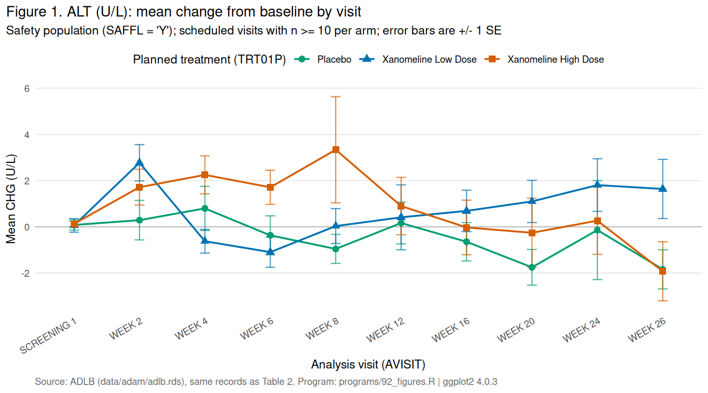

# adam-admiral-walkthrough

[](https://github.com/Ngarciar24/adam-admiral-walkthrough/actions/workflows/tests.yml)

ADaM datasets built with [{admiral}](https://pharmaverse.github.io/admiral/) from the public CDISC pilot study data in `{pharmaversesdtm}`.

I built this to learn the CDISC standards hands-on. It uses public test data only.

## What it does

- Builds **ADSL** (306 subjects), **ADLB** (BDS, five lab parameters) and **ADAE** (OCCDS) from SDTM.
- Derives treatment dates, population flags, baseline flags, change from baseline, reference-range indicators and treatment-emergent flags.
- Runs 163 `testthat` checks on the derivations, including unit tests of the baseline rule on hand-built data.
- Exports ADSL, ADLB and ADAE to SAS Transport (`.xpt`) with `{xportr}`, driven by a CSV specification, and verifies each file by reading it back against the spec.
- Produces a demographics table and a change-from-baseline table with `{rtables}` and `{tern}`, and a change-from-baseline figure with `{ggplot2}` that is checked cell by cell against the table.
- Re-checks the `.xpt` exports independently in Python: pandas re-derives the treatment-emergent flag from the dates in the file and must agree with admiral on every row.
- Rebuilds everything from scratch in GitHub Actions on every push, in a pinned `{renv}` environment.

## Run it

```r
renv::restore()
source("run_all.R")
```

```sh
python3 python/check_adam.py   # needs pandas
```

`run_all.R` rebuilds every dataset, exports the `.xpt` files, writes the tables and the figure, and runs the tests. Output is identical across rebuilds. The GitHub Actions workflow runs both commands.

## Layout

```
programs/00_setup.R          load SDTM, blanks to NA, read metadata
programs/01_adsl.R           ADSL
programs/02_adlb.R           ADLB (BDS)
programs/03_adae.R           ADAE (OCCDS)
programs/90_export_xpt.R     XPT export, spec coverage and round-trip checks
programs/91_tables.R         tables
programs/92_figures.R        figure
R/derive_ablfl.R             the baseline rule, shared by the program and its tests
metadata/                    dataset specification (CSV)
tests/testthat/              tests
outputs/                     tables, figure and a printed traceability trace
data/adam/                   adsl.xpt, adlb.xpt, adae.xpt
python/check_adam.py         pandas re-check of the exports
.github/workflows/tests.yml  CI
```

## Results

`run_all.R` ends with:

```
[ FAIL 0 | WARN 0 | SKIP 0 | PASS 163 ]
All programs run and all tests passed.
```

Change from baseline in ALT by visit (excerpt of `outputs/t2_alt_change_by_visit.txt`):

```
——————————————————————————————————————————————————————————————————————————
                      Placebo   Xanomeline Low Dose   Xanomeline High Dose
                      (N=86)          (N=84)                 (N=84)       
——————————————————————————————————————————————————————————————————————————
AVISIT                                                                    
  SCREENING 1                                                             
    n                   86              82                     84         
    Mean BASE          17.5            17.9                   19.1        
    Mean AVAL          17.6            18.0                   19.2        
    Mean CHG            0.1             0.1                   0.1         
  WEEK 2                                                                  
    n                   83              80                     78         
    Mean BASE          17.7            18.1                   19.2        
    Mean AVAL          18.0            20.9                   21.0        
    Mean CHG            0.3             2.8                   1.7
```

The same rows, drawn (`outputs/f1_alt_chg_by_visit.png`). The program that draws it stops if any plotted mean differs from the table cell:



The full tables, the `.xpt` files and a printed traceability trace are in `outputs/` and `data/adam/`.

## Traceability

One value, followed from SDTM to a table cell:

```
LB    01-701-1028  LBSEQ 135  ALT  WEEK 8  LBSTRESN 33
ADLB  01-701-1028  ASEQ 5     ALT  WEEK 8  AVAL 33  BASE 26  CHG 7
      BASE comes from the same subject's baseline row (ASEQ 1, ABLFL = Y, AVAL 26)
Table 2 / WEEK 8 / Mean CHG / Xanomeline High Dose
```

ADLB keeps `LBSEQ`, `VISIT` and `LBSTRESN` next to the analysis variables so every row can be traced back to its source record. The table program only filters and averages existing columns.

## Choices made here

There is no protocol or analysis plan for the pilot data, so these are my decisions:

- Baseline: last non-missing value on or before first dose, ties broken by `LBSEQ`.
- `SAFFL`: at least one dose, counting 0 mg placebo as a dose. `ITTFL`: randomised.
- `TRTEMFL`: onset on or after first dose.
- `CHG` is populated on every row, including pre-baseline rows.
- Unscheduled visits are grouped under one `AVISIT`; no visit windows.
- Figure 1 draws only visits with at least 10 subjects in every arm; Table 2 keeps every scheduled visit.

## Scope

Self-directed learning project on public test data. Not study work, not validated, no define.xml, no conformance run. Real study data would add partial dates, visit windows, multiple treatment periods and a define.xml; none of that is exercised here.

## Licence

MIT. Source data belongs to `{pharmaversesdtm}`.
