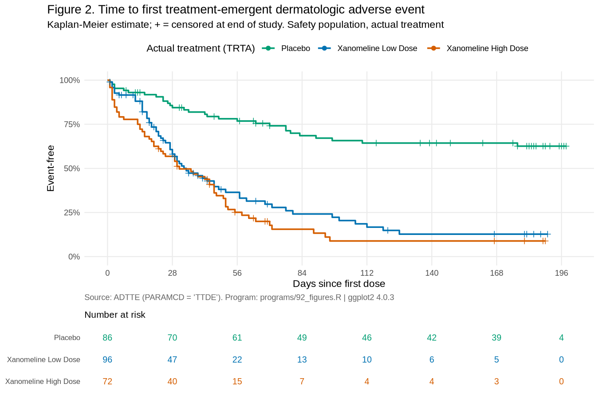

# adam-admiral-walkthrough

[](https://github.com/Ngarciar24/adam-admiral-walkthrough/actions/workflows/tests.yml)

ADaM datasets, define.xml and analysis outputs for the public CDISC pilot study (CDISCPILOT01), built in R with [{admiral}](https://pharmaverse.github.io/admiral/) and checked against the published pilot ADaM datasets.

## What it does

- **Datasets.** Builds ADSL, ADLB (BDS), ADAE (OCCDS), ADTTE (time to first dermatologic event) and ADQSADAS (ADAS-Cog, with analysis windows and LOCF) from SDTM.
- **Transport files and define.xml.** Exports all five to SAS Transport v5 from one specification (`metadata/`). The same specification generates a Define-XML 2.1 `define.xml`, validated against the CDISC schema and against the transport files.
- **Comparison with the pilot.** Compares every dataset with the published CDISC pilot ADaM datasets, variable by variable. Each difference must be explained in `metadata/pilot_differences.csv` or the run stops.
- **Outputs.** Produces a demographics table, an ALT change-from-baseline table and figure, a time-to-event table with a Kaplan–Meier plot, and the primary efficacy ANCOVA.
- **Checks.**
  - 225 `testthat` expectations on the derivations, including unit tests of the baseline rule on hand-built data.
  - 71 ADaM conformance checks.
  - An independent Python re-derivation of the treatment-emergent flag and the time-to-event data.
- **Reproducibility.** GitHub Actions rebuilds everything on every push, in a pinned `{renv}` environment.

## Results

Primary efficacy analysis (`outputs/t4_adascog_wk24_ancova.txt`). The Ns, differences, confidence intervals and p-values equal the published pilot table, as reproduced in the [R Consortium submission pilot](https://rconsortium.github.io/submissions-pilot1/articles/tlf-primary.html):

```
Table 4. ADAS-Cog(11) Total Score: Change from Baseline to Week 24 (LOCF)
Efficacy Population (EFFFL = 'Y'); planned treatment (TRTP)
                                           Placebo      Xanomeline Low Dose   Xanomeline High Dose
                                            (N=79)            (N=81)                 (N=74)
Change from baseline, mean (SD)           2.5 (5.80)        2.0 (5.55)             1.5 (4.26)
LS mean change (SE)                       2.5 (0.60)        2.0 (0.59)             1.5 (0.62)
LS mean difference vs placebo (95% CI)                   -0.5 (-2.1, 1.1)       -1.0 (-2.7, 0.7)
Dose-response p-value                       0.245
```

Time to first treatment-emergent dermatologic adverse event (`outputs/f2_ttde_km.png`):



Comparison with the published pilot ADaM (`outputs/qc/pilot_comparison.txt`):

```
Items compared: 68; matching: 48; explained differences: 20; unexplained: 0
```

The remaining differences come from four documented decisions: actual treatment, imputation of year-only dates, the laboratory baseline rule, and LOCF bookkeeping. See [docs/adrg.md](docs/adrg.md#61-differences-from-the-published-pilot-analysis).

## Run it

```r
renv::restore()
source("run_all.R")
```

```sh
pip install pandas lxml odmlib==0.2.1
python3 python/check_adam.py        # independent re-derivation
python3 python/validate_define.py   # define.xml schema and consistency
python3 python/adam_conformance.py  # ADaM conformance checks
```

`run_all.R` rebuilds every dataset, the `.xpt` files, define.xml, the tables and figures, then compares with the pilot and runs the tests. It downloads SDTM QS and the pilot reference datasets from a pinned commit of `phuse-scripts` and verifies their checksums, so it needs network access.

## Layout

```
programs/00_setup.R            load SDTM and metadata
programs/01_adsl.R             ADSL
programs/02_adlb.R             ADLB (BDS)
programs/03_adae.R             ADAE (OCCDS)
programs/04_adtte.R            ADTTE (time to event)
programs/05_adqsadas.R         ADQSADAS (windows, LOCF)
programs/90_export_xpt.R       XPT export, spec coverage and round-trip checks
programs/91_tables.R           Tables 1-2 and a traceability trace
programs/92_figures.R          Figures 1-2
programs/93_tables_tte_eff.R   Tables 3-4 (time to event, ANCOVA)
programs/94_define.R           define.xml and define.html
programs/95_compare_pilot.R    comparison with the published pilot ADaM
R/                             shared functions (baseline rule, pinned downloads)
metadata/                      specification, codelists, windows, explained differences
tests/testthat/                tests
python/                        independent checks
outputs/                       tables, figures; outputs/qc/ holds the QC reports
data/adam/                     .xpt files, define.xml, define.html
docs/sap.md                    analysis rules
docs/adrg.md                   analysis data reviewer's guide
docs/implementation-notes.md   technical notes and checked facts
```

## Traceability

One value, followed from SDTM to a table cell (`outputs/t2_traceability_chain.txt`):

```
LB    01-701-1028  LBSEQ 135  ALT  WEEK 8  LBSTRESN 33
ADLB  01-701-1028  ASEQ 5     ALT  WEEK 8  AVAL 33  BASE 26  CHG 7
      BASE comes from the same subject's baseline row (ASEQ 1, ABLFL = Y, AVAL 26)
Table 2 / WEEK 8 / Mean CHG / Xanomeline High Dose
```

ADLB keeps `LBSEQ`, `VISIT` and `LBSTRESN`, ADAE keeps `AESEQ`, ADQSADAS keeps `QSSEQ`, and ADTTE records `SRCDOM`/`SRCVAR`/`SRCSEQ`. define.xml gives the origin and derivation of every variable.

## Scope

Portfolio project on public test data, not a regulatory submission. Real study work would add a protocol-specific SAP, validated double programming, laboratory visit windows and a complete set of efficacy and safety parameters. The pilot data carry no MedDRA codes and no protocol deviations.

## Licence

MIT. Source data belong to `{pharmaversesdtm}` and the CDISC pilot project (via `phuse-scripts`); they are downloaded at run time, not redistributed.
